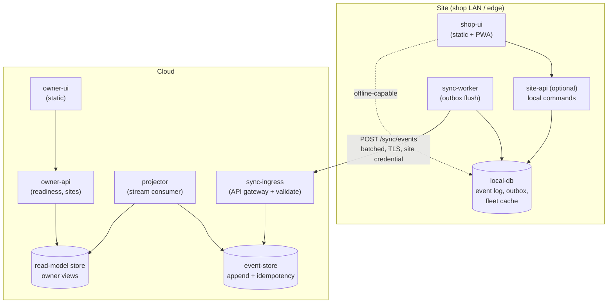
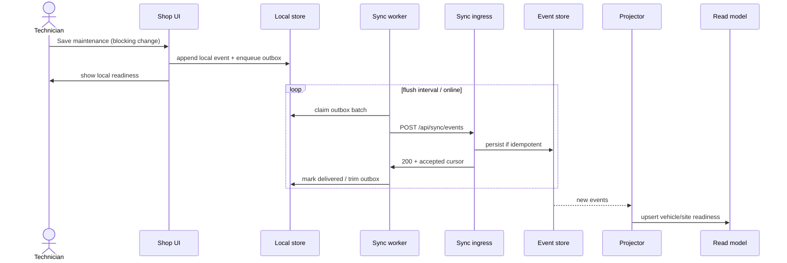

# Fleet Tracker

A mockup car fleet management webtool built with SvelteKit and JSON. Tracks vehicle status, open maintenance jobs (with priority and history), and parts on order.

**Today:** static SvelteKit UI seeded from JSON under `src/lib/data/`, with optional Vercel demo mode (`localStorage` + daily reset) and Phase 1 offline-sync demo pieces (`src/lib/sync/`, optional `npm run demo:sync-server`).

## Screenshots

| Dashboard | Fleet |
|-----------|-------|
| [](docs/dashboard.png) | [](docs/fleet.png) |

| Maintenance | Parts |
|-------------|-------|
| [](docs/maintenance.png) | [](docs/parts.png) |

- **Dashboard** — Summary cards with **stacked bar charts** (vehicles by status, open jobs by priority, parts on order by status; colors match status badges), availability metrics (fleet %, unplanned %, MTTR, PM compliance), repair trend by component chart, urgent maintenance table, and parts on order table.
- **Fleet** — Vehicle grid/list with status filter and optional `?status=ready`; edit (pencil) and remove (slide in edit panel only).
- **Maintenance** — Default view **By type**; open jobs with priority/status, due date, time in state; **New job** to create; edit (pencil) and remove (slide in edit panel only); expandable history and parts.
- **Parts** — **Order part** to add; edit (pencil) and remove (slide in edit panel only); link to maintenance jobs.

See **[docs/JOB-WORKFLOW.md](docs/JOB-WORKFLOW.md)** for a step-by-step guide and screenshots that explain the job workflow.

## Architecture

Target topology: operators use a **site** browser/PWA with local durable state and a sync worker; **cloud** hosts ingress, event store, projector, and owner-facing APIs. Full PlantUML, container/API status tables, and notes live in **[docs/PRODUCTION-ARCHITECTURE.md](docs/PRODUCTION-ARCHITECTURE.md)** ([diagram source](docs/diagrams/production-architecture.puml)).



## Sequence

Primary sync flow (happy path): a technician saves a maintenance change locally; the sync worker flushes the outbox to cloud ingress; the projector updates owner read models. Outage/reconnect and owner-read sequences are in the architecture doc.



## Remaining / planned capabilities

- Durable on-prem **local-db** (replace demo `localStorage`) and hardened **sync-worker** / **sync-ingress**
- Separate **owner-ui** + **owner-api** readiness views; production event-store and projector
- Security, backups/archives, VIN-scan phone apps, and public status-board URLs — see [docs/PROPOSAL-PRODUCTION-READINESS.md](docs/PROPOSAL-PRODUCTION-READINESS.md)
- Phase 1 offline sync change: `openspec/changes/add-offline-sync-phase1/`

## Run locally

```bash
npm install
npm run dev
```

Open [http://localhost:5173](http://localhost:5173).

## Build (static site)

```bash
npm run build
npm run preview
```

Output is in the `build/` directory.

## Deploy demo on Vercel (Option A)

Static hosting with **per-browser daily reset** (no shared server state). Each visitor gets seed JSON from the build; edits persist in `localStorage` until UTC midnight or manual reset.

1. Import the GitHub repo in [Vercel](https://vercel.com).
2. Framework preset: **Other** (or SvelteKit with output `build/`).
3. Build command: `npm run build` · Output directory: `build` (also in `vercel.json`).
4. Environment variable: `VITE_DEMO_MODE` = `true` (Production and Preview).
5. Deploy. The amber demo banner offers **Reset demo** anytime.

Local preview with demo mode:

```bash
VITE_DEMO_MODE=true npm run build
VITE_DEMO_MODE=true npm run preview
```

Optional: `VITE_SYNC_API_URL` for a remote sync API (not required for the static demo).

## Features

- **Dashboard** – Summary cards with stacked bar charts (vehicles by status, open jobs by priority, parts by status; colors match badges), availability metrics (fleet %, unplanned %, MTTR, PM compliance), repair trend by component chart, urgent maintenance and parts tables
- **Fleet** – Vehicle list or grid with status badges; filter by status; edit (icon) and remove only in edit panel
- **Maintenance** – Default view By type; New job; open jobs with priority/status, due date, time in state; edit and remove only in edit panel; expandable history and parts
- **Parts** – Order part; edit and remove only in edit panel; link to maintenance jobs

All data is read from JSON under `src/lib/data/` (no backend). Read-only mockup. Data model supports TPS/TOC-style metrics (planned vs unplanned, component, timestamps, technician assignment) and configuration (parts consumed, vehicle role).

## Optional: gstack (AI skills)

To add [gstack](https://github.com/garrytan/gstack) for Cursor/Codex-style agent skills in this repo (plan/review/QA workflow), see **[docs/GSTACK-CURSOR.md](docs/GSTACK-CURSOR.md)**. You need **Bun** to run gstack’s `./setup`. The doc also lists how gstack interacts with other Cursor skills (e.g. frontend-design, Playwright MCP).

## Spec-driven development (OpenSpec + Gherkin + Beads)

Vehicle and sync behavior are specified with Gherkin scenarios. See **`openspec/WORKFLOW.md`**.

- Living spec: `openspec/specs/vehicle/spec.md`
- Gherkin features: `features/vehicle.feature`
- Run tests: `npm test` and `npm run test:gherkin`
- Task tracking: `bd ready`

Phase 1 offline sync: **`openspec/changes/add-offline-sync-phase1/`**. Validate with `npx @fission-ai/openspec validate add-offline-sync-phase1 --strict`.

## Production readiness

This app is a mockup/prototype. Additional steps are required to make it production-ready: security requirements, database backup and archive of legacy jobs and sold vehicles, phone apps that scan VINs, and a user-facing status board with a unique URL for tracking an assigned car. See the separate proposal: [docs/PROPOSAL-PRODUCTION-READINESS.md](docs/PROPOSAL-PRODUCTION-READINESS.md).

Deep architecture (PlantUML topology, container/API inventory, outage and owner-read sequences) remains in **[docs/PRODUCTION-ARCHITECTURE.md](docs/PRODUCTION-ARCHITECTURE.md)**.

## Regenerating screenshots

After changing the UI, rebuild and run the screenshot script:

```bash
npm run build
node scripts/screenshots.mjs
```

Screenshots are saved to `docs/` (dashboard, fleet, maintenance, parts, and maintenance-edit for the job workflow doc).
