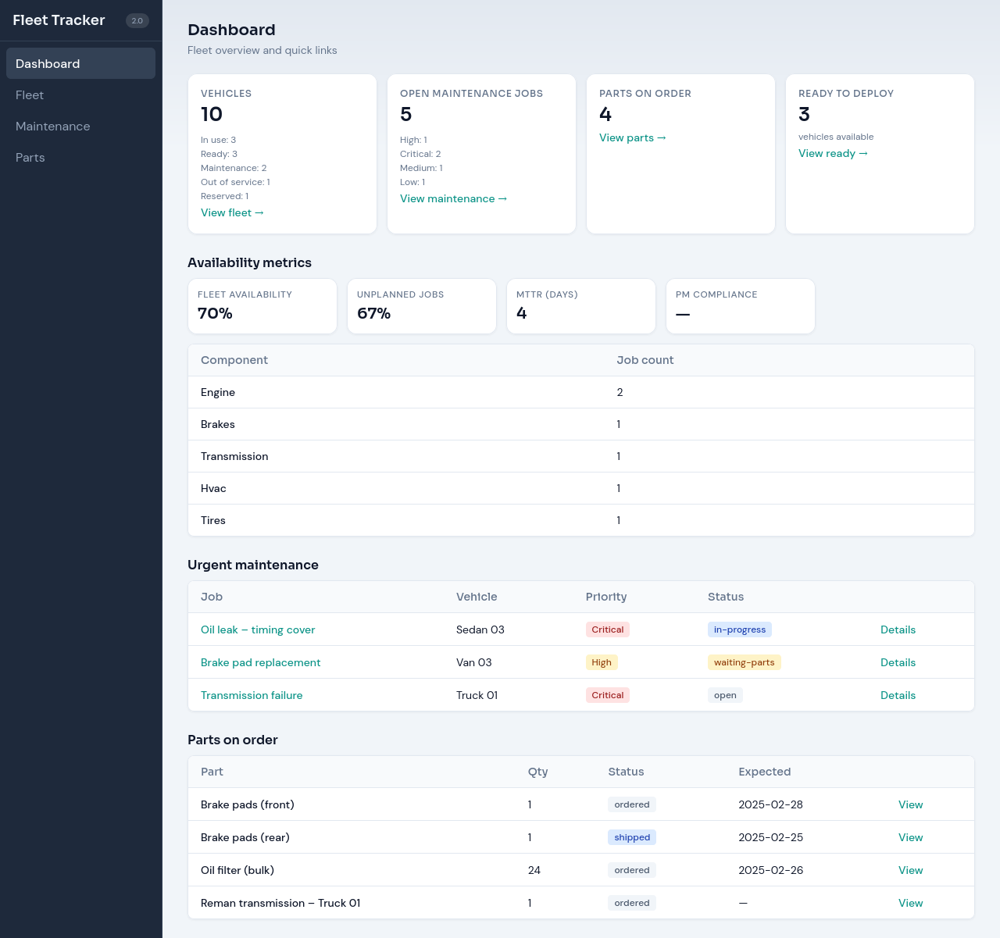
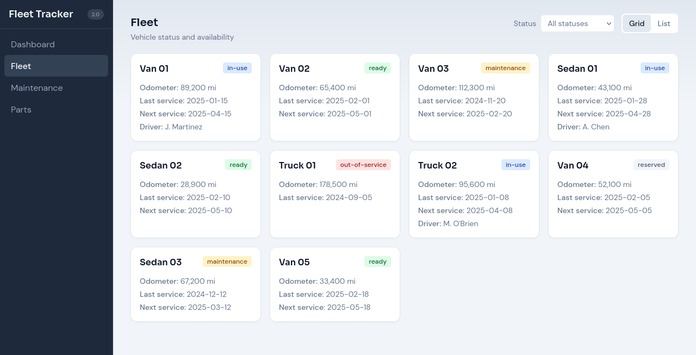
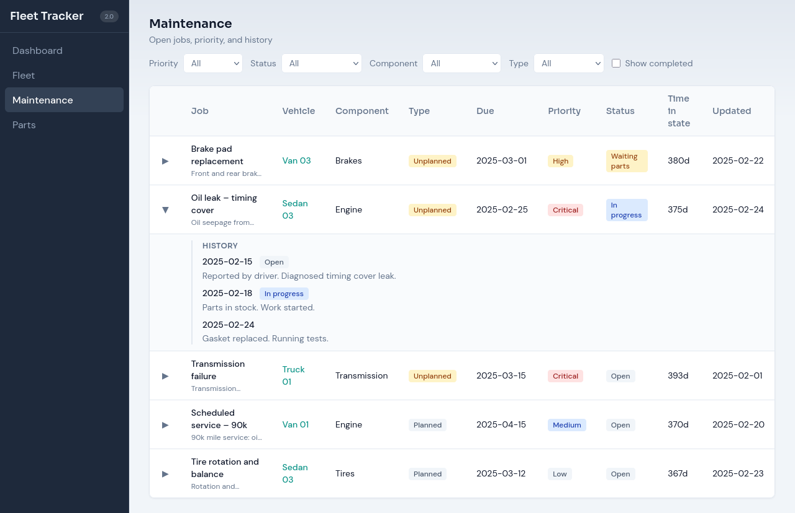
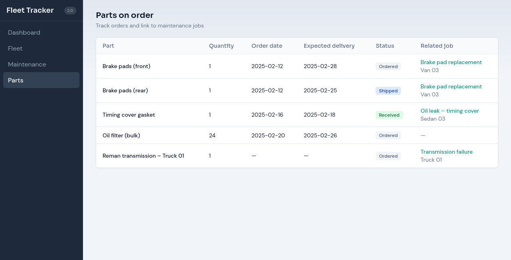

# Fleet Tracker

A mockup car fleet management webtool built with SvelteKit and JSON. Tracks vehicle status, open maintenance jobs (with priority and history), and parts on order.

**v2.0** — Redesigned with the frontend-design skill: industrial/utilitarian aesthetic, Sora + DM Sans typography, cohesive palette (teal accent, CSS variables), compact top-anchored layout, staggered reveals, and refined accessibility (focus states, semantics).

## Screenshots

| Dashboard | Fleet |
|-----------|-------|
| [](docs/dashboard.png) | [](docs/fleet.png) |

| Maintenance | Parts |
|-------------|-------|
| [](docs/maintenance.png) | [](docs/parts.png) |

- **Dashboard** — Summary cards, availability metrics (fleet %, unplanned %, MTTR, PM compliance), repair trend by component, urgent maintenance, and parts on order.
- **Fleet** — Vehicle grid/list with status filter and optional `?status=ready`.
- **Maintenance** — Open jobs with component, planned/unplanned, due date, time in state; filters by component and type; expandable history.
- **Parts** — Orders with links to related jobs.

## Run locally

```bash
npm install
npm run dev
```

Open [http://localhost:5173](http://localhost:5173).

## Build (static site)

```bash
npm run build
npm run preview
```

Output is in the `build/` directory.

## Features

- **Dashboard** – Summary cards (vehicles by status, open jobs, parts on order), availability metrics (fleet availability %, unplanned %, MTTR, PM compliance %, repair trend by component), urgent maintenance list, parts on order list
- **Fleet** – Vehicle list or grid with status badges; filter by status; optional `?status=ready` query
- **Maintenance** – Open jobs with component, planned/unplanned, due date, time in state; filter by priority, status, component, and type; expandable row for job history
- **Parts** – Parts on order with status and link to related maintenance job

All data is read from JSON under `src/lib/data/` (no backend). Read-only mockup. Data model supports TPS/TOC-style metrics (planned vs unplanned, component, timestamps, technician assignment) and configuration (parts consumed, vehicle role).

## Regenerating screenshots

After changing the UI, rebuild and run the screenshot script:

```bash
npm run build
node scripts/screenshots.mjs
```

Screenshots are saved to `screenshots/`. Copy them to `docs/` for the README (or change the script’s `SCREENSHOTS_DIR` to `docs/`).
