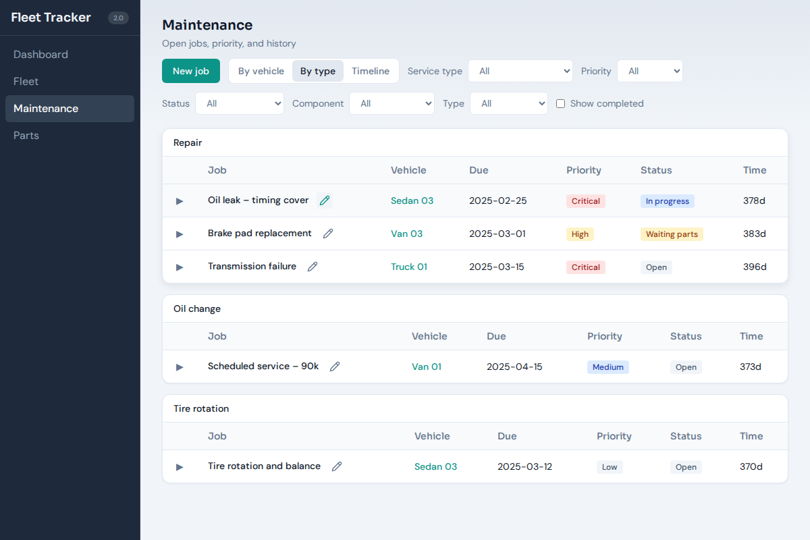

# Maintenance job workflow

This document describes how maintenance jobs move through the app from creation to completion.

## Overview

1. **New job** — Create a job from the Maintenance page (default view: *By type*).
2. **Open** — Job starts in *Open* status; you can assign priority, due date, component, and link parts.
3. **In progress / Waiting parts** — Update status as work proceeds; optional history entries.
4. **Completed** — Mark complete; vehicle can be released back to the fleet.

Screenshots below illustrate the main surfaces.

---

## 1. Maintenance page (By type)

The default view groups open jobs by **service type** (Oil change, Fluid change, Repair, etc.). Each row shows job title, vehicle, due date, priority, and status. Use the pencil icon to **edit** a job; expand the row to see history, parts, and OBD2 data.

- **New job** — Opens the add panel to create a job and assign a vehicle, type, and priority.
- **Edit** (pencil) — Opens the edit panel for that job (update status, add history, link parts, remove job via slide-to-remove).
- **Remove** — Only available inside the **edit panel** (slide control) to avoid accidental deletion.

---

## 2. Job edit panel

From Maintenance, click the pencil icon on a job to open the edit panel. Here you can:

- Change **status**: Open → In progress → Waiting parts → Completed.
- Add **history** entries (date + note) to document steps.
- Set **due date**, **component**, **service type**, and **planned** flag.
- Link **parts** (from the Parts page, link a part order to this job).
- **Save job** — Primary action on the right.
- **Remove job** — Slide-to-confirm control on the left (reduces accidental taps).

---

## 3. Fleet and vehicle lifecycle

From **Fleet**, select a vehicle and use **Edit** (pencil) to open the vehicle edit panel. There you can:

- **Intake** — Mark vehicle in for maintenance (status → Maintenance, link to a job).
- **Checkout** — Assign driver and set status to In use.
- **Release** — Return vehicle to ready pool (only when the vehicle has no open maintenance job).

Vehicle status and current job are reflected on the Dashboard and Maintenance views.

---

## 4. Parts on order

From **Parts**, use **Order part** to add an order; **Edit** (pencil) to update status or link the part to a **maintenance job**. Linked parts appear in the job’s expanded row and in the job edit context.

---

## Summary

| Step        | Where           | Action |
|------------|------------------|--------|
| Create job | Maintenance      | **New job** → fill form → save |
| Update job  | Maintenance      | Pencil icon → edit panel → change status/history → **Save job** |
| Remove job | Maintenance      | Pencil icon → edit panel → **Slide to remove** → confirm |
| Intake/Release | Fleet        | Select vehicle → Pencil → **Intake** / **Release** / **Checkout** |
| Link parts | Parts            | **Order part** or Edit part → set related job |

Screenshots: run `npm run build` then `node scripts/screenshots.mjs` to regenerate; the script saves images to `docs/` for use in this doc and the README.
