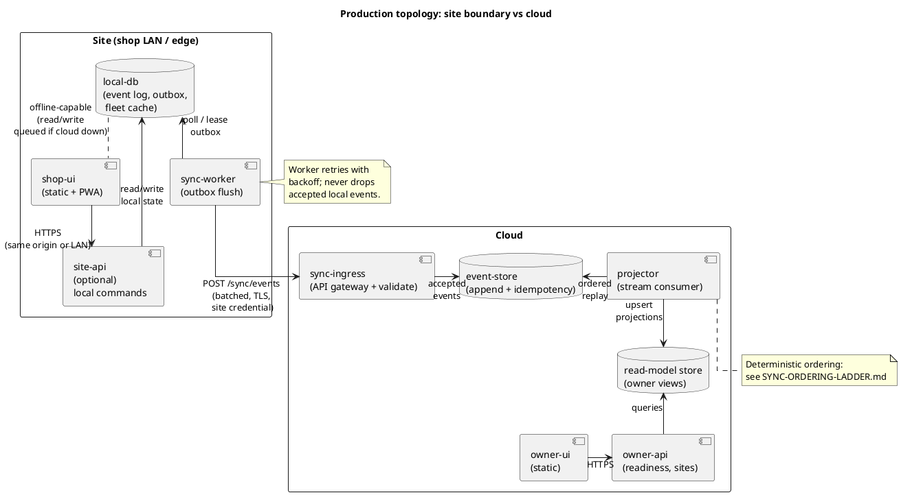
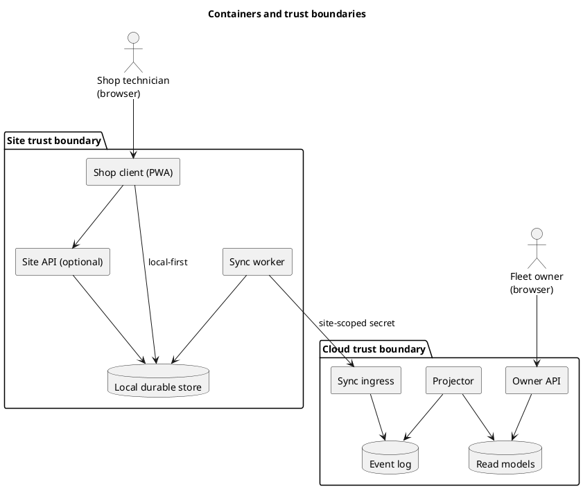
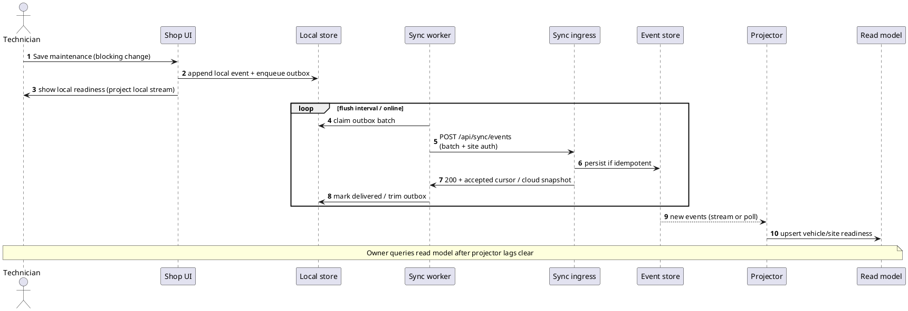
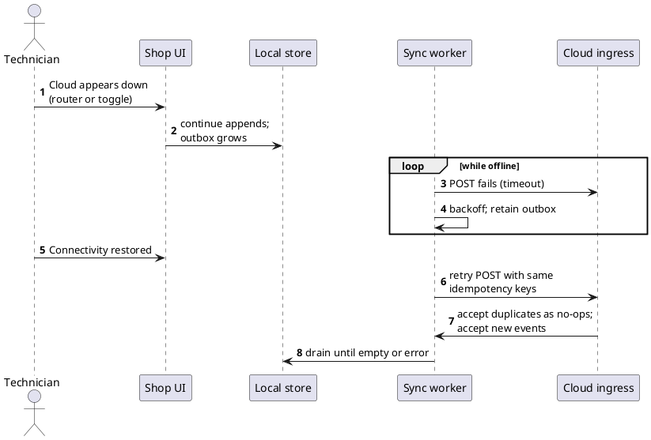
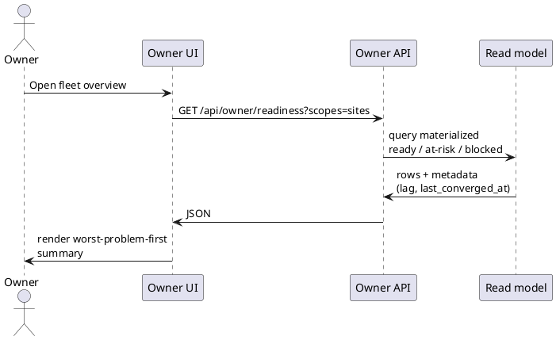

# Production architecture (operational site + cloud)

This document describes the **anticipated** deployment for a real shop operating with local-first sync and an owner-visible cloud projection. It complements [OFFICE-HOURS-DESIGN-20260327.md](OFFICE-HOURS-DESIGN-20260327.md), [PHASE1.md](PHASE1.md), and [SYNC-ORDERING-LADDER.md](SYNC-ORDERING-LADDER.md).

**How to view PlantUML:** use a PlantUML plugin (VS Code, IntelliJ), [plantuml.com](https://www.plantuml.com/plantuml), or render the bundled [diagrams/production-architecture.puml](diagrams/production-architecture.puml) locally.

---

## 1. Target topology (containers)

High-level view: **operators use a browser client** at the site. A **site boundary** (Compose stack or k8s namespace) holds durable local state and a **sync worker**. **Cloud** hosts ingress, durable events, projection, and owner-facing APIs.

### 1.1 Deployment diagram

### 1.2 Logical components (C4-style, containers only)

---

## 2. Container and API inventory (production)

Statuses:

| Status | Meaning |
|--------|---------|
| **In repo (demo)** | Exists today in this repository in some form (may be in-browser or demo server only). |
| **Spec’d** | Contract or behavior documented; implementation not production-hardened. |
| **Planned** | Required for production; design agreed, not built here yet. |
| **Later** | Phase 2+ or optional hardening (transfer pipeline, advanced auth, multi-region). |

### 2.1 Site (operational) containers

| Container / runtime | Responsibility | Status |
|---------------------|----------------|--------|
| **shop-ui** | Static assets + PWA shell; talks to local API or IndexedDB adapter. | In repo (demo): SvelteKit static app. |
| **site-api** (optional) | Normalize VIN scan, local RBAC, serve cached fleet JSON to LAN clients. | Planned |
| **sync-worker** | Drain outbox, backoff, TLS to cloud, structured error handling. | In repo (demo): in-browser timer + optional `demo-sync-server` client path. |
| **local-db** | Durable append-only site log, outbox table(s), optional materialized fleet view. | In repo (demo): `localStorage`; production Planned (SQLite/Postgres volume). |

### 2.2 Cloud containers

| Container / runtime | Responsibility | Status |
|---------------------|----------------|--------|
| **sync-ingress** | Authenticate site, validate envelope, rate limit, return reject codes. | In repo (demo): `scripts/demo-sync-server.ts` (minimal). |
| **event-store** | Persist accepted events; enforce idempotency key uniqueness. | Spec’d (TS types + in-memory/file demo); durable store Planned. |
| **projector** | Consume event stream (or batch), apply ordering ladder, update read models. | In repo (demo): same process as accept in demo; separate consumer Planned. |
| **read-model store** | Owner queries: per-site and global readiness, projection lag metadata. | In repo (demo): JSON blob in demo server file; DB Planned. |
| **owner-api** | REST/GraphQL for owner UI; read-only, cache-friendly. | Partially spec’d (`GET /api/sync/state` shape); production Planned. |
| **owner-ui** | Static multi-site dashboard (may be separate build from shop-ui). | Planned (today shop and owner are not split deployables). |

### 2.3 APIs (minimum set)

| API | Direction | Purpose | Status |
|-----|-----------|---------|--------|
| `POST /api/sync/events` | Site → cloud | Batch append with `X-Site-Key` / `X-Site-Id`; idempotent accept. | In repo (demo): demo server. |
| `GET /api/sync/state` (or site-specific read) | Site → cloud | Fetch accepted event set or snapshot for local reconciliation / owner parity checks. | In repo (demo): demo server. |
| `GET /api/owner/...` | Owner UI → cloud | Readiness by site, blocked counts, health (lag, last converged). | Planned |
| (internal) **projector consume** | Projector → event-store | Cursor-based replay, DLQ for poison pills. | Planned |
| **Site local** `POST /local/...` (optional) | Shop UI → site-api | When not fully offline-first in browser; LAN-only operations. | Planned |

TLS, rotation of site credentials, and observability (structured logs, metrics) are **Planned** for every internet-facing hop.

---

## 3. Sequence diagrams

### 3.1 Happy path: maintenance event reaches cloud and read model

### 3.2 Simulated outage and reconnect

### 3.3 Owner reads readiness (cloud)

---

## 4. Mapping to this repository

| Production piece | Where to look today |
|------------------|---------------------|
| Event envelope, validation, ordering | `src/lib/sync/` |
| Site key demo | `src/lib/sync/siteAuth.ts`, `constants.ts` |
| Demo cloud container (single process) | `scripts/demo-sync-server.ts`, `npm run demo:sync-server` |
| Shop UI (not split from owner yet) | `src/routes/`, `/sync` |

Splitting **shop-ui** and **owner-ui**, adding a real **event-store** and **projector** service, and replacing **localStorage** with on-prem DB volumes are the main gaps before this diagram matches a live production system.

</think>

<｜tool▁calls▁begin｜><｜tool▁call▁begin｜>
StrReplace